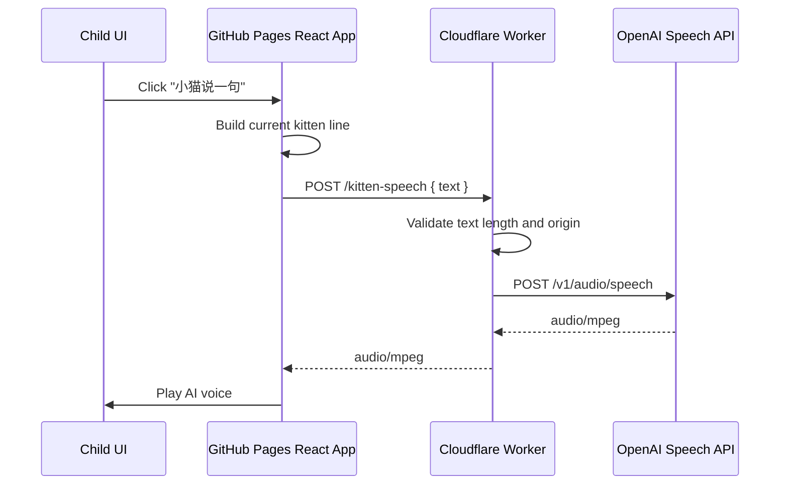

# AI Kitten Voice Design

## Goal

Upgrade the kitten from browser-local speech synthesis to AI-generated text-to-speech while keeping the current static GitHub Pages frontend safe, resilient, and easy to extend later.

## Current Context

The app is a Vite React static site deployed from GitHub Pages. The kitten already has local speech text in `src/domain/petSpeech.ts`, a browser voice fallback in `src/components/petVoice.ts`, and UI entry points in `src/components/PetPanel.tsx`.

The current local voice uses `window.speechSynthesis`, which depends on the user's browser and operating system voice packs. AI voice should improve quality without exposing an OpenAI API key in client-side code.

## OpenAI Capability

Use OpenAI's Text to Speech Speech API, `POST /v1/audio/speech`, with `gpt-4o-mini-tts`. The official guide describes the speech endpoint as text-to-speech, supports built-in voices, supports multiple languages including Chinese, and allows `instructions` to shape tone, speed, intonation, and emotion.

OpenAI policy guidance in the Text to Speech documentation requires clear disclosure to end users that generated TTS audio is AI-generated and not a human voice.

References:

- https://developers.openai.com/api/docs/guides/text-to-speech
- https://developers.openai.com/api/docs/api-reference/audio/createSpeech

## Recommended Architecture

Add a small Cloudflare Worker as a server-side voice proxy. The React app calls the Worker, and the Worker calls OpenAI with the API key stored as a Worker secret.



## Frontend Behavior

`src/components/petVoice.ts` becomes the single voice gateway:

- If `VITE_KITTEN_VOICE_API_URL` is configured, it tries AI voice first.
- It posts the kitten line to the configured endpoint.
- It plays the returned audio using an object URL.
- If the network request, response type, or playback fails, it falls back to the existing local `speechSynthesis` voice.
- It keeps the existing short sound effect in `PetPanel` so children still get immediate feedback.

The function should return a typed result so tests and UI can distinguish:

- `ai`: AI voice played.
- `local`: browser local voice played.
- `silent`: no voice mechanism was available.

## Worker Behavior

Create a Worker under `workers/kitten-voice`.

Endpoint:

- `POST /kitten-speech`
- Request JSON: `{ "text": string }`
- Response success: `audio/mpeg`
- Response validation failure: JSON error with `400`
- Response OpenAI failure: JSON error with `502`

Validation:

- Text must be a non-empty string.
- Text is trimmed.
- Text length is capped at 180 characters to keep latency and cost bounded.
- The Worker only accepts `POST` for speech generation.

OpenAI request:

- `model`: `gpt-4o-mini-tts`
- `voice`: `coral` initially
- `input`: sanitized text
- `instructions`: "用温柔、可爱、鼓励孩子的中文小猫语气说话。语速稍慢，情绪明亮，不要夸张尖叫。"
- default response format: MP3

Security:

- `OPENAI_API_KEY` lives only as a Worker secret.
- The frontend never receives or stores the API key.
- CORS allows the GitHub Pages origin and local dev origin.

## Configuration

Add `.env.example`:

```bash
VITE_KITTEN_VOICE_API_URL=https://your-worker.your-subdomain.workers.dev/kitten-speech
```

For local development without a Worker, leaving this variable empty keeps the current browser-local voice behavior.

Cloudflare secret setup:

```bash
wrangler secret put OPENAI_API_KEY
```

## User-Facing Disclosure

Add a short, low-friction disclosure near the kitten interaction area:

```text
小猫语音由 AI 生成，不是真人声音。
```

This should be visible in the full-screen kitten panel after AI voice support is configured. It should not be presented as a warning modal.

## Error Handling

The child experience should not stop when AI voice fails.

- Worker unavailable: use local voice.
- OpenAI returns an error: use local voice.
- Browser blocks audio playback: keep text bubble updated and do not throw UI errors.
- Missing `VITE_KITTEN_VOICE_API_URL`: use local voice.

The UI does not need to show technical error details to children. Console warnings are acceptable for developers.

## Testing

Frontend tests:

- AI endpoint configured and returns audio: fetch is called, audio playback is attempted, result is `ai`.
- AI endpoint fails: local voice fallback is called, result is `local`.
- No endpoint configured: local voice is called directly.
- Pet panel still updates the speech bubble when speaking.

Worker tests:

- Empty text returns `400`.
- Overlong text is trimmed and capped before sending to OpenAI.
- Valid request forwards to OpenAI with the expected model, voice, input, and instructions.
- OpenAI audio response is proxied as `audio/mpeg`.
- OpenAI failure returns `502`.
- CORS preflight returns allowed methods and headers.

## Out Of Scope

- Realtime speech-to-speech conversation with the child.
- Child microphone upload or transcription.
- Long-term audio caching.
- Custom cloned voices.
- Parent voice consent workflow.
- Per-child voice personalization.

These can be added later after AI TTS is stable.
